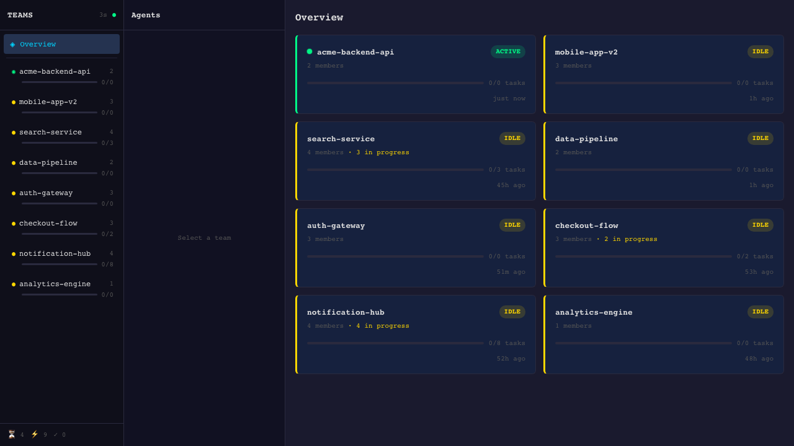
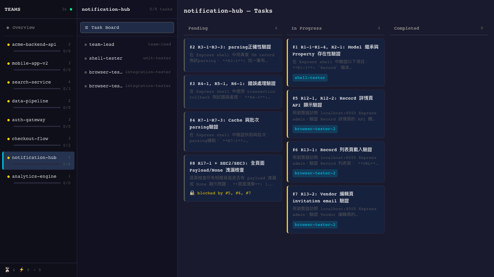
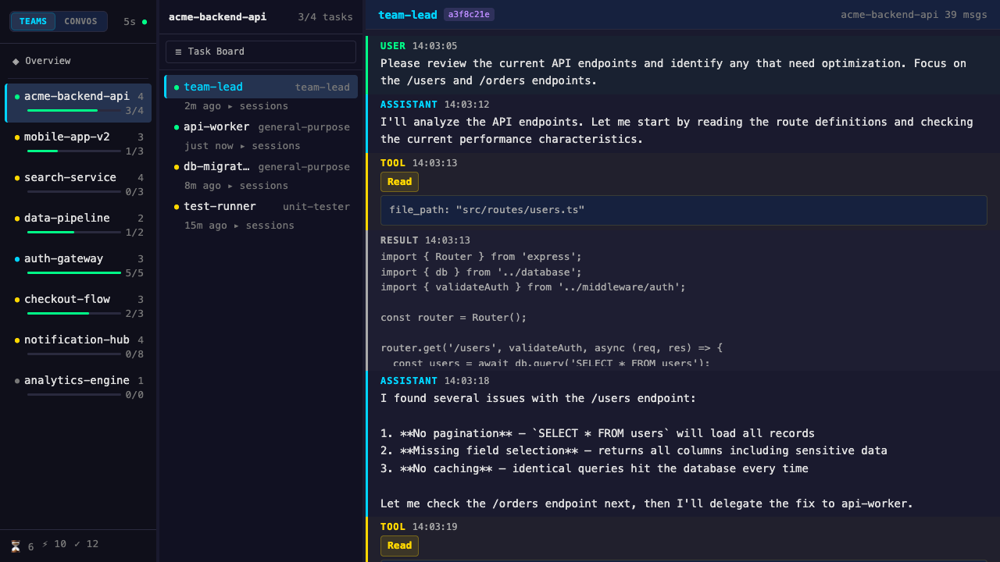

# Agent Teams Dashboard

即時監控 [Claude Code](https://claude.ai/code) agent teams 的 Web 儀表板。透過 WebSocket 串流更新，追蹤團隊協作、任務進度與 agent 活動狀態。

[English](https://github.com/pingshian0131/agent-teams-dashboard/blob/main/README.md)

## 功能

- **雙側邊欄導航** — 三欄式佈局：TeamsPanel → AgentsPanel → MainPanel
- **團隊總覽** — 即時狀態卡片，含 status dots、進度條、成員數
- **Agent Sessions** — 按 agent 分組的 session 時間軸，可展開檢視
- **看板式任務面板** — Pending / In Progress / Completed 三欄式任務追蹤
- **Agent 活動監控** — 即時顯示每個 agent 的訊息與工具使用紀錄
- **WebSocket 即時更新** — 檔案系統變更自動推送至瀏覽器

### 佈局

```
┌──────────────┬────────────────┬──────────────────────┐
│ TeamsPanel   │ AgentsPanel    │ MainPanel            │
│ (200px)      │ (260px)        │ (flex: 1)            │
└──────────────┴────────────────┴──────────────────────┘
```

## Demo

### 總覽 — 團隊狀態卡片


### 任務面板 — 看板檢視


### Agent 面板 — 活動詳情


## 快速開始

```bash
npx agent-teams-dashboard
```

開啟瀏覽器前往 `http://localhost:3001`。

可用 `PORT` 環境變數更改埠號：

```bash
PORT=8080 npx agent-teams-dashboard
```

## 從原始碼開發

### Docker（推薦）

```bash
docker compose up
```

開啟瀏覽器前往 `http://localhost:5173`。修改程式碼會自動 hot reload。

### 手動啟動

```bash
npm install

# 終端機 1 — 啟動後端
npm run server

# 終端機 2 — 啟動前端開發伺服器
npm run dev
```

開啟瀏覽器前往 `http://localhost:5173`。

## 指令

| 指令 | 說明 |
|------|------|
| `npm run dev` | 前端開發伺服器（Vite，port 5173） |
| `npm run server` | 後端伺服器（port 3001） |
| `npm run build` | 建置前端至 `dist/` |
| `npm run build:server` | 編譯後端至 `server-dist/` |
| `npm run preview` | 預覽正式建置結果 |
| `docker compose up` | Docker 一鍵啟動前後端 |

## 技術棧

- **前端：** React 19 + TypeScript + Vite 6
- **後端：** Node.js + native HTTP + ws（WebSocket）
- **資料來源：** 監視 `~/.claude/teams/`、`~/.claude/tasks/`、`~/.claude/projects/` 目錄

## 正式環境部署

```bash
npm run build
npm run server
```

伺服器會從 `dist/` 提供靜態檔案，API 與 WebSocket 在同一個 port（預設 3001，可用 `PORT` 環境變數覆蓋）。

## 靈感來源

靈感來自 [Claude Code Agent Teams Demo](https://youtu.be/Gmzh9HP7JGM?si=LDUFqPz0syBsWuta)

## 授權

MIT
